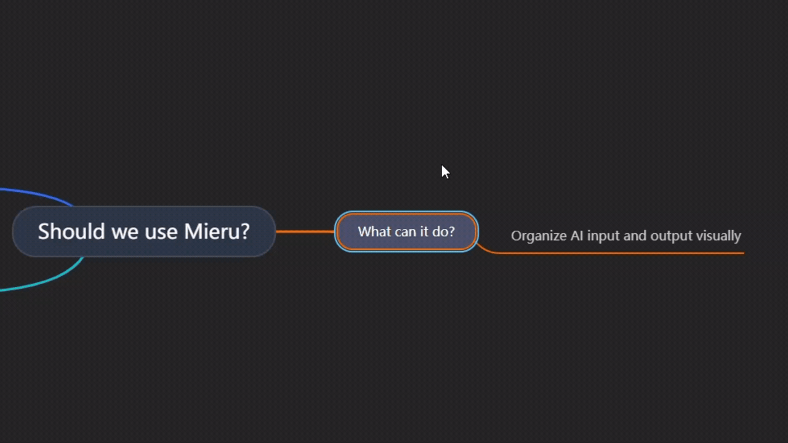

# Mieru

**English** ｜ [日本語](./README.ja.md)

**A tool for building the ideas you feed an AI, kept as plain `.md` throughout**

Spread your thinking out as a mind map, and what you have is an ordinary Markdown file.

That file is the prompt.

**➜ [https://mieru-app.github.io/mieru/](https://mieru-app.github.io/mieru/)**
(Nothing to install. It runs in the browser.)




https://github.com/user-attachments/assets/bb92dee9-08e8-4d18-8c9b-8695f3bf38ac

---

## Problems this solves

**You want to ask an AI, but your thinking has not come together.**
Your thoughts scatter, and you end up pasting a wall of text anyway.
In Mieru you sort your thinking out as a mind map, and
**that shape is the input.** Organizing and writing up stop being two jobs.

**You draw a mind map, and it falls apart when you export it.**
Most tools save in their own format, and Markdown export is a lossy afterthought.
In Mieru, **Markdown is the save format itself.** There is no export step.

**Mind map tools do not play well with anything else.**
Obsidian and VS Code open the very same file, untouched.
**Mieru is built to keep you out of vendor lock-in.**
Put it in Git and you can read how your thinking changed, as a diff.

---

## How to use it

**1. Open it.** Just a link. No account, no sign-up.
➜ [https://mieru-app.github.io/mieru/](https://mieru-app.github.io/mieru/)

**2. Just start.** "Try guest mode" lets you begin without choosing storage first.

**3. Pick where files are saved.** Two options, switchable later.

| Storage | What lands there | Where it works |
|---|---|---|
| **A local folder** | `.md` files directly in the folder you pick | Desktop Edge / Chrome |
| **A GitHub repository** | `.md` files in the repo you name (each save is a commit) | Any device |

If you pick a folder, Mieru only ever touches **the `.md` files directly inside it**.

**4. Write.** `Tab` adds a child, `Enter` adds a sibling.
Press `?` for the shortcuts. On a phone, the buttons at the bottom do the same things.
**There is no save button.** It saves on its own.

**5. Hand it to an AI.** `Ctrl+Shift+C` copies your map as prose an AI reads well.
You can select part of the map and copy only that.

Here is what the saved `.md` looks like:

```markdown
---
title: Where to take the new product
tags: [strategy]
---

# Where to take the new product

- Market 🌏
  - Size
    Published reports say $1.2B, but the definition looks too wide.
    Narrowed to what we could actually reach, $300M is the honest number.
  - Where nobody is competing
- Risks ⚠️
  - Regulation → [[Market]]
```

---

## What it is good for

**Sorting out your thinking before you prompt.**
Split the question into branches, hand the structure to an AI,
and the answer comes back as specific as you hoped.
Send one branch at a time and nothing gets buried in a context that is too long.

**Drafting the backbone of a presentation.**
A presentation lives on its storyline. You can build the content
while keeping the whole argument in view.
**Notes never appear on the canvas**, so you can write the talk track into them
and still see the whole map at a glance.

**Inside an Obsidian vault.**
Point Mieru at a folder in your vault and you can edit across tools.
Wiki-style links work as you would expect.

**Catching ideas away from your desk.**
With GitHub as the storage, the same canvas opens on your phone,
and you pick it up on your computer later.

---

## What it cannot and can do

### It cannot

| Not supported | Why |
|---|---|
| **Embedded images** | Deliberately out of scope, to keep the Markdown portable. Image URLs are fine |
| **Free-form canvas** | Trees only. If you want sticky notes placed anywhere, this is the wrong tool |
| **Real-time collaboration** | Out of scope. Several people means several repositories, one each |
| **AI that draws the map for you** | Left out on purpose. Doing the thinking is the point |
| **Horizontal rules and raw HTML** | `---` and `<div>` are dropped on save. You get a warning, but the line is gone. [Known issue](./docs/ideas/2026-09-05-blockquote-code.md) |

### It can

| Supported | Notes |
|---|---|
| **Edit as a diagram** | Canvas and outline views, `Ctrl+E` to switch |
| **Read the exact `.md` that gets saved** | A third view, read-only, byte-for-byte what is written |
| **Render tables, blockquotes, code blocks, bold and links** | Inside notes. Blockquotes and code blocks are kept byte-for-byte |
| **Work offline** | Installable as a PWA |
| Work entirely from the keyboard | `?` shows the shortcuts |
| Go back to an earlier version | Every 5 minutes locally; every commit on GitHub |
| Full-text search and tag filters | `Ctrl+F` |
| Edit from a phone | When GitHub is the storage |

---

## How it compares

What Mieru gives you is that **you edit it as a diagram and the save format is Markdown itself.**

| | Edit as a diagram | Save format | Opens without an app | Phone | Cost |
|---|---|---|---|---|---|
| **Mieru** | yes | **`.md` itself** | yes, browser only | yes | Free |
| XMind | yes, strong | `.xmind` (proprietary) | no | yes | 10 maps free; Markdown export is paid |
| markmap / markmap for VS Code | view only | reads `.md` | no, needs VS Code | no | Free |
| Obsidian + Mind Map (markmap) | view only | reads `.md` | no, needs Obsidian | yes | Free |
| Obsidian Canvas | yes, free-form | **`.canvas` (JSON)** | no | yes | Free |

(Checked on 2026-09-05.
[Competitive research](./docs/ideas/2026-09-05-stp-and-marketing.md), in Japanese.)

**Reasons you might pick Mieru:**

- **You want to reach your maps from a machine without Obsidian installed.** A browser is enough
- **Obsidian's own Canvas saves as JSON.** You want the result of thinking visually to stay `.md`
- **The editable mind map plugins have gone quiet.**
- **You want a guarantee that opening and saving does not change your file.**
  Round-tripping normalized `.md` is tested to be byte-identical, continuously,
  against randomly generated trees

---

## Common questions

*1. Where is my data, and who can see it?*
Only where you put it. **There is no server and no database.**
Mieru is served as static files; your files never reach the developer.
With GitHub as storage, traffic goes straight from your browser to `api.github.com`.

*2. What is the GitHub token used for?*
Reading and writing `.md` files in the repository you named. Nothing else.
**The token is stored in this browser and it is not encrypted.**
That is why we suggest creating it for **one repository, Contents permission only,
with an expiry date.** The app walks you through it.
On a shared machine, untick "remember on this device."

*3. Is that actually safe?*
**Any app that runs only in a browser and handles credentials has code, delivered to you,
that can touch those credentials.** That is not specific to Mieru.
So it is made checkable instead. All the code is in this repository.
No third-party CDN, web font or analytics is loaded, and a Content Security Policy
restricts network access to `api.github.com`.
**Even if credential-stealing code got in, it would have nowhere to send anything.**
If you would rather not trust this origin,
[host it yourself](./CONTRIBUTING.md#自分でホストする).

*4. Does it work offline?*
Yes. It installs as a PWA and you can read and edit without a connection.
With GitHub storage, the save happens once you are back online.

*5. Which browsers work?*
Any browser, if you use GitHub as the storage.
Using a folder on your computer needs Edge or Chrome (it uses the File System Access API).

*6. Can I open `.md` files written elsewhere?*
Yes. **Backslash escapes, bold, code spans and links all survive verbatim.**
**Saving does reformat the document into Mieru's style** (bullets become `-`,
indentation becomes two spaces, and frontmatter keys get a fixed order).
The limits listed above **take effect the moment you open and save.
Keep a copy of anything you care about before opening it.**

*7. Can I use it alongside Obsidian or VS Code?*
Yes. Point it at a folder in your vault or repository and both open the same `.md`.
Edit in either order, but **saving from Mieru normalizes the formatting.**

---

## Contributing

Bug reports, ideas and code are all welcome.
Setup, project layout and how to host it yourself are in
**[CONTRIBUTING.md](./CONTRIBUTING.md)** (Japanese).
Participation is covered by the [Code of Conduct](./CODE_OF_CONDUCT.md).

For the thinking behind the design, see the
[architecture notes](./docs/human-review/architecture.md) and the
[design index](./docs/design.md) (Japanese).
The current state of the project is in the [roadmap](./docs/human-review/roadmap.md) (Japanese).

## License

**MIT.** See [LICENSE](./LICENSE).
Use it, change it and redistribute it freely, commercially or otherwise.

## Contact

Bugs and ideas go to [Issues](https://github.com/mieru-app/mieru/issues).

**Please do not report security problems in a public issue.**
See [SECURITY.md](./SECURITY.md) for how to report privately, what is in scope,
and what is already known and accepted.
